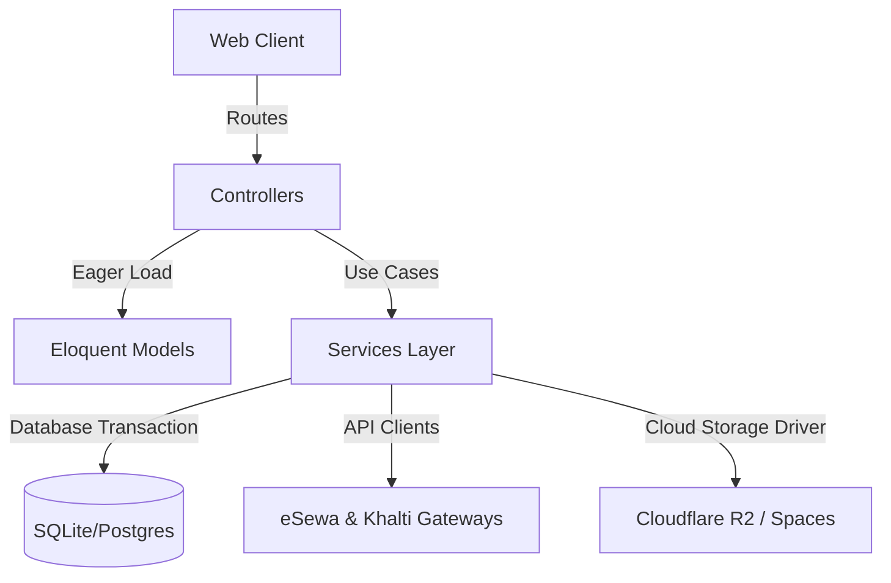

# GrocerEase v2 — E-Commerce Enterprise Suite

Welcome to **GrocerEase v2**, a modern, secure, and production-grade rewrite of the legacy GrocerEase e-commerce platform. Built with **Laravel 11 / PHP 8.3**, this application elevates the original procedural PHP site into a secure, modular, service-oriented architecture designed to handle high transaction volumes with sub-second response times.

---

## 🏛️ Architecture & System Design

GrocerEase v2 employs a **Service-Repository Pattern** to decouple database mutations, third-party payment gateways, and image processing from controller endpoints. This ensures that application controllers remain thin and testable, while business logic is fully isolated.



### Key Technical Achievements by Stage

#### 🔐 Stage 3: Enterprise Auth Guarding & Middleware
*   **Legacy Flaw**: The original admin area had no authentication layer—URLs were exposed to any visitor.
*   **V2 Solution**: Fully rewritten authentication flow using secure hashing (BCrypt) with distinct roles.
*   *Security Features*: Added a highly robust custom `AdminMiddleware` that intercepts requests to all admin endpoints and blocks unauthorized accounts.

#### 📦 Stage 4: High-Performance Product Catalog
*   **Legacy Flaw**: Direct database query injections, missing URL slugs, and manual pagination calculations.
*   **V2 Solution**: Implemented a comprehensive search & dynamic filtration engine inside `ProductService`.
*   *Key Features*: Supports category filters, brand filters, min/max price boundaries, and raw keyword wildcard searches. Supports SEO-friendly slugs using `Str::slug`.

#### 🛒 Stage 5: Session-Cart Engine with Automatic Merging
*   **Legacy Flaw**: Cart association relied entirely on the user's IP address (a severe security vulnerability).
*   **V2 Solution**: Designed a session-based state machine via `CartService`.
*   *Cart Sync*: 
    - **Guests**: Associated using a secure session-stored UUID (`session('cart_id')`).
    - **Authenticated Users**: Mapped directly to `user_id` in the database.
    - **Automatic Reconciliation**: On login, guest items are automatically transferred and merged into the user's persistent cart, deduplicating products and enforcing strict stock-quantity limits.

#### 💳 Stage 6: Atomic Checkout & Double-Spend Prevention
*   **Legacy Flaw**: Prone to overselling due to race conditions during parallel transactions.
*   **V2 Solution**: Implemented strict transactional atomicity inside `OrderService::placeOrder`.
*   *Concurrency Protection*: Uses `DB::transaction()` with pessimistic database locking. Line-item pricing is snapshotted directly from the live product catalog, and checkout automatically aborts with an exception if any product drops below the required stock levels.

#### 💸 Stage 7: Dual Nepal-Payment Gateway Integrations
*   **eSewa (v2)**: Integrates modern HMAC-SHA256 signature authorization using the base64-encoded payload protocol. Handled via a hidden form auto-POST redirection mechanism inside `esewa_redirect.blade.php`.
*   **Khalti**: Fully API-driven payment orchestration that requests transaction URLs dynamically from the Khalti Sandbox endpoints and maps verification callouts transparently.
*   *Reliability*: Fully logged payment tracking maps states (`pending` → `completed`/`failed`) ensuring reliable auditing.

#### 📊 Stage 8: Rich Admin Dashboard & Intervention Image Processor
*   **Dashboard**: Full business insight showing aggregate revenue (from paid orders), transaction metrics, product stats, and low-stock alarms (`stock_quantity < 5`).
*   **Image Optimization**: Leverages the `Intervention Image` library (v3) to intercept multi-image file uploads, instantly scales them down to `800x800` (preserving aspect ratio), and saves them using the custom driver.
*   **Order Management**: Full data table with range-based date filters and dynamic, zero-reload AJAX order status transition validation.

#### ☁️ Stage 9: S3/R2 Storage Decoupling & Importer Command
*   **Cloud Decoupling**: Installed S3 Flysystem driver to serve files out-of-box from Cloudflare R2 or DigitalOcean Spaces. Dynamic URL resolution resolves to `Storage::disk(config('filesystems.default'))->url($path)` seamlessly.
*   **Artisan Importer**: Wrote a high-performance console migration utility `php artisan grocerease:migrate-images` which scans and transfers legacy files from the old project, uploads them to the active storage disk, and updates DB mappings.

#### 🎨 Stage 10: Smooth Anchor Scroll & High-Contrast Green Footer
*   **Smooth Section Scrolling**: Integrated direct anchor scroll buttons in the main navigation. Clicking on "Categories", "Brands", or "Contact" smoothly navigates the user using native CSS `scroll-behavior: smooth;` layout parameters.
*   **High-Contrast Premium Footer**: Redesigned the developer contact block using a high-visibility, deep brand-green linear gradient. Re-engineered typography using highly legible crisp white (`#ffffff`) and mint-white (`#e8f5e9`) text on top of a dark glassmorphic card overlay (`rgba(0, 0, 0, 0.22)`), yielding perfect readability.

---

## 📂 Key File & Service Map

Below is a roadmap of the critical service and controller configurations:

```
app/
├── Http/
│   ├── Controllers/
│   │   ├── Admin/
│   │   │   ├── DashboardController.php   # Business intelligence metrics
│   │   │   ├── ProductController.php     # Image resizing CRUD
│   │   │   ├── CategoryController.php    # Slugs & Integrity constraints
│   │   │   └── OrderController.php       # AJAX status transitions
│   │   └── PaymentController.php         # Payment gateway endpoint routes
│   └── Middleware/
│       └── AdminMiddleware.php           # Security gatekeeper for admin routes
├── Services/
│   ├── ProductService.php                # High-performance catalog filtering
│   ├── CartService.php                   # Merges guest & authenticated carts
│   ├── OrderService.php                  # Atomic transactional checkout flow
│   └── PaymentService.php                # eSewa v2 signature & Khalti gateway
└── Console/
    └── Commands/
        └── MigrateImages.php             # Bulk legacy image cloud importer
```

---

## 🔗 Route Map & Direct URLs

### 🌐 Public Portal (User Facing)
- **Homepage (Catalog)**: [http://localhost:8000/](http://localhost:8000/)
- **Product Details**: `http://localhost:8000/products/{slug}`
- **Shopping Cart**: [http://localhost:8000/cart](http://localhost:8000/cart)
- **Checkout**: [http://localhost:8000/checkout](http://localhost:8000/checkout)
- **Login / Register**: [http://localhost:8000/login](http://localhost:8000/login)

### 🚀 Production Portal (Railway Live)
- **Production URL**: [https://grocerease.up.railway.app/](https://grocerease.up.railway.app/)
- **Admin Dashboard**: [https://grocerease.up.railway.app/admin](https://grocerease.up.railway.app/admin)

### 👑 Enterprise Control (Admin Restricted)
*Must log in as an administrator (credentials provided below).*
- **Admin Dashboard**: [http://localhost:8000/admin](http://localhost:8000/admin)
- **Product Management**: [http://localhost:8000/admin/products](http://localhost:8000/admin/products)
- **Category Control**: [http://localhost:8000/admin/categories](http://localhost:8000/admin/categories)
- **Brand Control**: [http://localhost:8000/admin/brands](http://localhost:8000/admin/brands)
- **Order Tracking**: [http://localhost:8000/admin/orders](http://localhost:8000/admin/orders)

---

## 🕵️ Troubleshooting & Errors Logging

If you encounter any unexpected application issues, Laravel stores full stack traces in:
📂 **`/storage/logs/`**

- **Primary Error Logs File**: `storage/logs/laravel.log`
- *Pro-tip*: You can tail live errors via console: `tail -f storage/logs/laravel.log`
