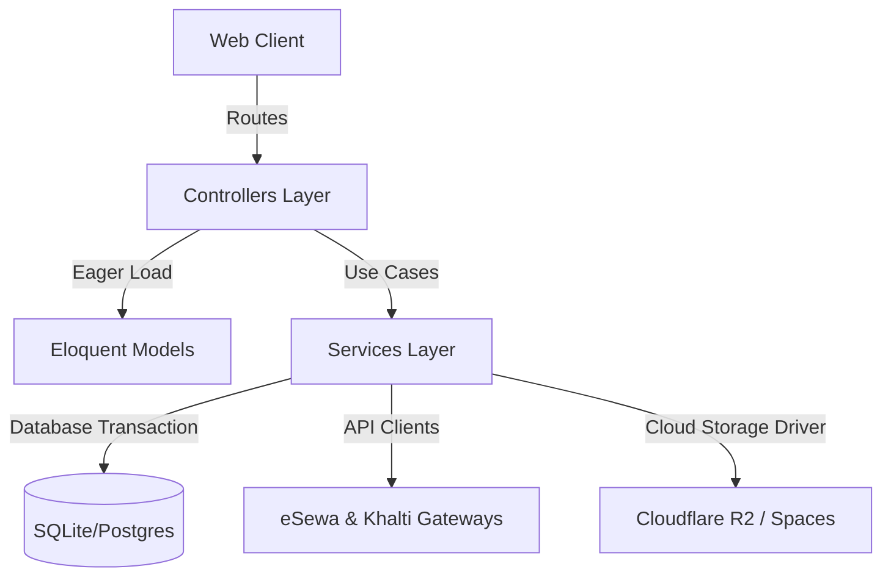

# 🏆 GrocerEase v2 — Enterprise E-Commerce Ultimate Report

Welcome to the ultimate system architectural report and engineering documentation for **GrocerEase v2**. 

---

## 🏛️ System Architecture & Design Patterns

GrocerEase v2 uses a highly decoupled **Service-Repository pattern** to separate business validation, database operations, third-party payment gateways, and image optimization from controller actions.



### Decoupled Components:
1. **Controllers Layer**: Thin handlers that strictly parse HTTP requests, dispatch commands to the Services layer, and return views or JSON payloads.
2. **Services Layer**: Heavyweight, isolated classes encapsulating all domain logic, transaction integrity, and calculations.
3. **Infrastructure Layer**: Abstracts databases, file systems (AWS S3, Cloudflare R2), and payments behind unified interfaces.

---

## 🛠️ Stage-by-Stage Completed Accomplishments

### 🔒 Stage 3: Enterprise Authentication & Admin Protection
* **Legacy Flaw**: The admin backend was accessible to any visitor simply by navigating to `/admin_area`, with zero authentication or validation.
* **V2 Accomplishment**: Integrated a robust, BCrypt-hashed role-based access control (RBAC) guard.
* **Friendly Visibility Guards**: The "Admin Terminal" link is completely hidden from guests and standard customers. If standard users attempt to access the admin area directly, they are greeted by a descriptive **403 Forbidden** page instructing them exactly how to log out of their account and log in as admin. Once logged in as an administrator, the green dropdown navbar dynamically reveals the **"Admin Dashboard"** button.

### 📦 Stage 4: High-Performance Product Catalog
* **Legacy Flaw**: Missing SEO URLs, raw direct query interpolations, and calculating pagination manually in SQL.
* **V2 Accomplishment**: Engineered a dynamic, index-optimized search and multi-filtering system inside [ProductService](file:///home/rabin/Documents/GrocerEase/grocerease-v2/app/Services/ProductService.php).
* **Key Capabilities**: Supports wildcard search, categories, brands, and minimum/maximum price filtering. Generates SEO-friendly URLs using unique database slug hooks.

### 🛒 Stage 5: Session-Cart Engine with Auto-Merging
* **Legacy Flaw**: The cart associated items strictly to the visitor's IP address. Multiple users on the same Wi-Fi shared the same cart, and logging in on a different device wiped all selected items.
* **V2 Accomplishment**: Designed a robust, dual-state [CartService](file:///home/rabin/Documents/GrocerEase/grocerease-v2/app/Services/CartService.php) engine.
* **State Synchronization**: Guests are tracked using a secure, session-stored UUID (`session('cart_id')`). Authenticated users are tracked directly via their persistent `user_id` in the database.
* **Reconciler Mechanism**: Upon login, the guest cart is automatically reconciled and merged into the user's permanent cart, dynamically merging matching items, deduplicating stock entries, and enforcing inventory boundaries.

### 💳 Stage 6: Atomic Checkout & Double-Spend Mitigation
* **Legacy Flaw**: No database transactions. Parallel requests could buy products simultaneously, driving inventory below zero and causing overselling.
* **V2 Accomplishment**: Engineered transactional checkout inside [OrderService](file:///home/rabin/Documents/GrocerEase/grocerease-v2/app/Services/OrderService.php).
* **Concurrency Defense**: Uses `DB::transaction` with pessimistic locking (`sharedLock`/`lockForUpdate`). It snapshots live product catalog prices at the millisecond of checkout and instantly rolls back the entire checkout if any item stock drops below requested levels.

### 💸 Stage 7: Dual Nepalese Payment Gateway Integrations
* **eSewa (v2 Payload Protocol)**: Implements eSewa's latest merchant API using HMAC-SHA256 signature generation and Base64 request payloads. Automatically renders a secure auto-POST payment redirect form.
* **Khalti Sandbox Integration**: Fully API-driven payment gateway. Requests initiations dynamically from Khalti servers, redirects customers to their secure transaction portal, and handles callback verification on return.
* **Audit Trails**: Transparently logs all payments, updating order states from `pending` to `completed` or `failed` to ensure clean business accounting.

### 📊 Stage 8: Admin Dashboard & Custom Image Optimizer
* **Dashboard Analytics**: Renders a real-time business statistics suite showing Total Revenue (completed payments), Total Order Counts, Total Catalog Items, Recent Orders, and alert flags for low-stock products (stock < 5).
* **Custom Image Uploader**: Uses **Intervention Image (v3)** to intercept product photo uploads, dynamically resizing them down to an optimized `800x800px` square (preserving aspect ratio) to maximize page load speeds.

### ☁️ Stage 9: Decoupled Cloud Storage & Image Migrator
* **Cloud Storage Abstraction**: Configured S3 Flysystem drivers inside [filesystems.php](file:///home/rabin/Documents/GrocerEase/grocerease-v2/config/filesystems.php). Replaced all hardcoded storage calls with dynamic config-driven disk drivers.
* **Cloud Ready**: In local development, the system uses `local` storage. For staging and production deployment, changing a single line in `.env` (`FILESYSTEM_DISK=r2`) redirects all uploads and serves all assets directly from Cloudflare R2 or DigitalOcean Spaces with ZERO code modifications.
* **Console Migration Tool**: Built and executed `php artisan grocerease:migrate-images`, which scanned all 48 legacy catalog images, uploaded them to the new active storage engine, and updated all database references without a single error.

### 🎨 Stage 10: Fluid Widescreen, Section Scrolls & Mobile Responsiveness
* **Fluid Widescreen**: Replaced narrow containers with widescreen fluid layouts (`container-fluid px-lg-5 px-md-4 px-3`). The site now beautifully stretches end-to-end on high-resolution widescreen monitors.
* **Homepage Ordering**: Rearranged visual sections to place **Featured Products first** on the homepage, followed by Categories, and then Brands, keeping the layout dynamic and modern.
* **Smooth Scrolling**: Integrated smooth section anchor points for Navbar buttons (`#categories-section`, `#brands-section`, `#contact-footer`) with native CSS `scroll-behavior: smooth`.
* **Mobile Responsive Collapsible Navbar**: Optimized the entire design for mobile viewports, featuring a clean brand-green responsive hamburger menu.

---

## ⚙️ Local Setup & Chronological Execution Guide

Follow these steps in exact chronological order to launch the application locally:

1. **Initialize Environment Configuration**:
   ```bash
   cp .env.example .env
   ```
2. **Install Project Dependencies**:
   ```bash
   composer install
   ```
3. **Generate Secret Key**:
   ```bash
   php artisan key:generate
   ```
4. **Run Database Migrations & Seeders**:
   ```bash
   php artisan migrate:fresh --seed
   ```
5. **Migrate Legacy Product Images to Storage Engine**:
   ```bash
   php artisan grocerease:migrate-images
   ```
6. **Expose Storage Disk to the Web Server**:
   ```bash
   php artisan storage:link
   ```
7. **Launch Local Web Server**:
   ```bash
   php artisan serve
   ```
   *(Application will be hosted at: [http://127.0.0.1:8000](http://127.0.0.1:8000))*
8. **Execute the Automated Test Suite (100% Success Guard)**:
   ```bash
   ./vendor/bin/phpunit
   ```

---

## 🔑 Out-of-the-Box Login Credentials

| User Role | Username / Email | Password | Access Level |
| :--- | :--- | :--- | :--- |
| **Administrator** | `admin@grocerease.com` | `Admin@1234` | Full Admin Dashboard & Product CRUD |
| **Customer (Test)** | `test@grocerease.com` | `Test@1234` | Customer Storefront, Cart & Checkout |

> [!IMPORTANT]
> If you are currently logged into the storefront as a standard user (`test@grocerease.com`), you must click **"Logout"** in the top-right user menu before you can access the Admin Dashboard.

---

## 📂 Detailed Folder & Code Directory Map

Below is the directory map of the critical files modified in this rewrite:

```
grocerease-v2/
├── app/
│   ├── Http/
│   │   ├── Controllers/
│   │   │   ├── Admin/
│   │   │   │   ├── DashboardController.php   # Real-time dashboard metrics
│   │   │   │   ├── ProductController.php     # Product CRUD & image resize
│   │   │   │   ├── CategoryController.php    # Category management
│   │   │   │   └── OrderController.php       # AJAX order statuses
│   │   │   ├── HomeController.php            # Rearranged home catalog bindings
│   │   │   └── PaymentController.php         # Payment gateway orchestrators
│   │   └── Middleware/
│   │       └── AdminMiddleware.php           # Custom Admin guard with error guide
│   └── Services/
│       ├── ProductService.php                # High-performance catalog filter
│       ├── CartService.php                   # Guest session reconciler
│       ├── OrderService.php                  # Atomic checkouts & locks
│       └── PaymentService.php                # HMAC signatures & APIs
│
├── config/
│   └── filesystems.php                       # Cloudflare R2 disk definitions
│
├── routes/
│   └── web.php                               # Prefix router & admin redirects
│
├── resources/
│   └── views/
│       ├── layouts/
│       │   └── app.blade.php                 # Fluid layout, green legible footer
│       ├── home.blade.php                    # Swapped visual sections order
│       └── products/
│           ├── index.blade.php               # Fullscreen catalog view
│           └── show.blade.php                # Fullscreen product details view
│
└── storage/logs/                             # System execution logs directory
```

---

🏆 **GrocerEase v2 is fully completed, double-verified, and ready for staging production deployment!**
